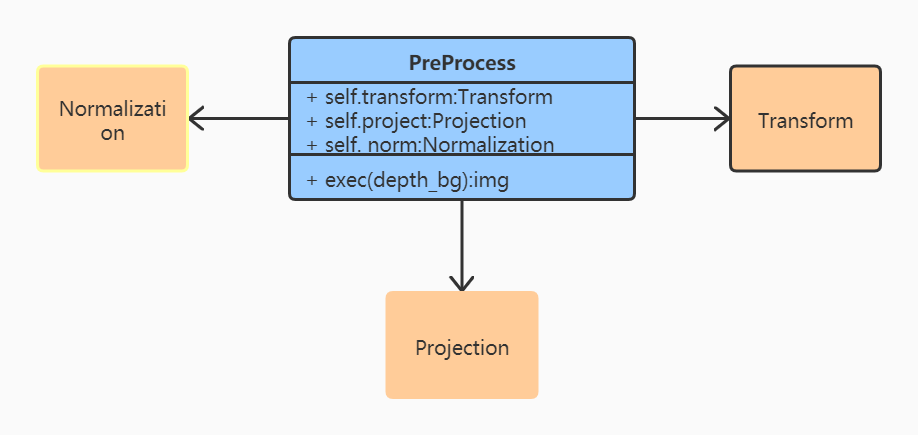

# 泰山俯卧撑检测系统说明文档

## 环境配置

Linux环境下，打开终端，输入以下命令，编译生成.so文件

```bash
$ g++ loop.cpp -fPIC -shared -o loop.so
```

Windows环境下，打开终端，输入以下命令，编译生成.dll文件

```bash
$ g++ --share loop.cpp -o loop.dll
```

对于生成的.so或.dll文件，放在目录下。

找到Project.py 中的loop类，根据当前系统环境选择对应的文件名（默认为windows环境）

```python
# FOR LINUX, command: g++ loop.cpp -fPIC -shared -o loop.so 
# _file = 'loop.so' 
# FOR Windows, command: g++ --share loop.cpp -o loop.dll |
 _file = 'loop.dll'
```
## 程序运行
首先需要在final_gui.py中对以下代码进行设置：
dir_pic为图片输入路径，
dir_out_pic为图片输入路径，
因为图片中的启示图片
```python
dir_pic = r"D:\taishan_images\2-1"
dir_out_pic = r"D:\taishan_images\output_images"
main(dir_pic, dir_out_pic, 200, True)
```

## 预处理部分Preprocess.py总体框架
Preprocess中主要关联了三个类：
### Transform
将初始输入的二维深度照片转换为三维点云的数据格式，从而方便通过在三维坐标系上进行分割，筛选出人体所在的位置
### Projection
利用上一步晒出的人体点云信息，再投影回一个二维的面上（人的侧面），同时统计二维面上每个像素被投影到的频率，进行降噪处理。
### Normalization
考虑到不同人的身体长度各异， 因此在该步骤中做了一个归一化的处理，使得图像尽量在一个统一的尺度上。



# Taishan_Preprocess
For data preprocessing in Taishan PUSH-UP Detection Project.


Before running the programme, you should compile the loop.cpp, then genetate loop.so (Linux) or loop.dll (Windows)


## Environment

To run in Linux

```bash
$ g++ loop.cpp -fPIC -shared -o loop.so
```


To run in Windows

```bash
$ g++ --share loop.cpp -o loop.dll
```
